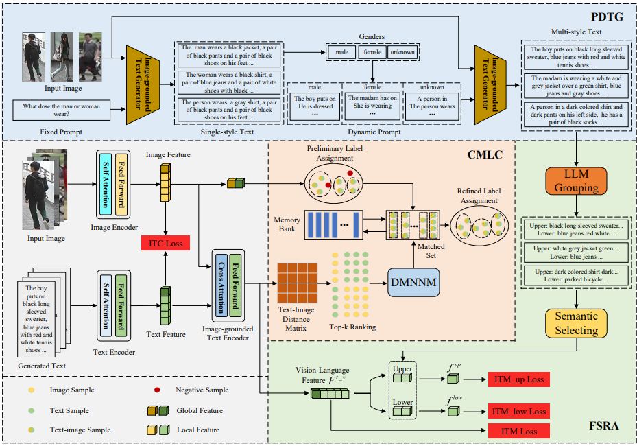

# PSPD
# Unsupervised Cross-Modal Person Search via Progressive Diverse Text Generation



## Abstract 

  While text-based person search (TBPS) has achieved notable progress in recent years, existing methods heavily rely on laboriously annotated and well-aligned pedestrian image-text pairs, incurring prohibitive annotation costs. To overcome this limitation, we propose to train a TBPS model using pure images without any annotations. To tackle this challenging problem, we propose an unsupervised cross-modal person search framework via Progressive Diverse Text Generation (PSPD), leveraging large pre-trained models as assistants. Particularly, PSPD features three modules: Progressive Diverse Text Generation (PDTG), Fine-grained Saliency Region Alignment (FSRA) and Cross-Modal pseudo Label Correction (CMLC), allowing training with only unannotated images. The PDTG generates and dynamically adjusts prompts to produce accurate, diverse textual descriptions in multiple styles. The FSRA then uses large language models to generate fine-grained attributes and achieves cross-modal fine-grained semantic alignment. Additionally, the CMLC is applied to eliminate pseudo label noise through dual mutual nearest-neighbor matching, combined with distance-based judgment and a voting mechanism. Experimental results demonstrate the effectiveness of our method in unsupervised settings across various text-based person search datasets.


### Getting started

Install dependencies

```
pip install -r requirements.txt
```

Any components in NLTK can be found [here](https://github.com/nltk/nltk_data/tree/gh-pages).


### Prepare pretrained model

Download pretrained baseline from [model_base](https://storage.googleapis.com/sfr-vision-language-research/BLIP/models/model_base.pth ) from [BLIP](https://github.com/salesforce/BLIP) and put **model_base.pth** at **./checkpoint**


### Prepare datasets

Download datasets: [CUHK-PEDES](https://github.com/ShuangLI59/Person-Search-with-Natural-Language-Description)   [ICFG-PEDES](https://github.com/ShuangLI59/Person-Search-with-Natural-Language-Description)  [RSTPReid](https://github.com/NjtechCVLab/RSTPReid-Dataset) and put at **./datasets**

The files shall be organized as:

```
|---configs
|---data
|---models
|---datasets
|	---CUHK-PEDES
|	---ICFG-PEDES
|	---RSTPReid
|---checkpoint
|	---model_base.pth

```

### Generate a training dataset for training blip text generation model by qwen model.

```
python gen_pre_trian_text.py
```

### Training the blip text generation model.

```
python pre_train.py
```

### Generating training datasets for PSPD

```
python gen_text.py
```

## Training

```
bash train.bash
```

### Evaluation

```
bash eval.bash
```

